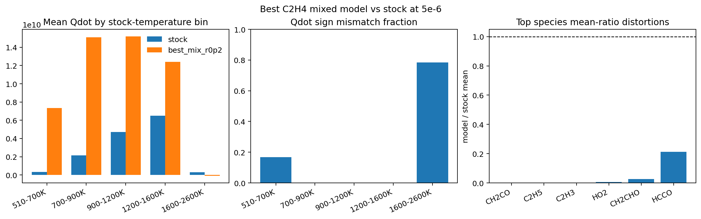

# C2H4 best-mix vs stock error anatomy: the current best mixed model still has a two-regime source-term pathology—massive over-driving in cooler active cells and widespread sign errors in the hot bulk

_Date: 2026-04-24_

## Why this was the next step

After pausing the local canonical-mix hill-climb, the next highest-value question was not another dataset ratio but:

- where does the current best C2H4 learned model still differ from stock,
- and does that point to a label/target problem rather than a small calibration problem?

So I compared the current best mixed C2H4 model directly against the stock DeepFlame C2H4 baseline on the **matched mesh at `5e-6`**.

## Cases compared

### Stock reference
- `/root/workspace/runs/deepflame_c2h4_smoke/c2h4_stock_baseline_np8_gpu_stocksrc`

### Current best mixed learned model
- `/root/workspace/runs/deepflame_c2h4_smoke/c2h4_casepair_dp100_plus_canonical_r0p2_fno_batched_full`

## New diagnostic script

- `/root/workspace/scripts/compare_deepflame_c2h4_best_vs_stock.py`

This comparison works on the full matched field data and reports:
- activity overlap
- active-region `Qdot`, `T`, and `p` differences
- key-species distortions in the active union
- temperature-binned source-term behavior
- ranked species distortions

## Artifacts

- JSON:
  - `/root/workspace/artifacts/experiments/deepflame_c2h4_smoke_analysis/c2h4_bestmix_r0p2_vs_stock_5e-06.json`
- figure:
  - `/root/workspace/docs/findings/images/c2h4-bestmix-r0p2-vs-stock-5e-06.png`

## Figure

## Activity overlap is not the main issue

The learned model is not failing simply because it activates in a completely different part of the mesh.

At `5e-6`:
- stock active cells (`T > 510 K`): `34773`
- model active cells: `35217`
- active union: `35217`
- active intersection: `34773`
- model-only active fraction of the whole mesh: `0.0004234`

So the learned model and stock are acting on almost the same active region.

That means the dominant remaining problem is **what the learned model does inside the active region**, not gross activation mismatch.

## Active-region bulk metrics

On the active union:
- stock mean `Qdot`: `4.828e8`
- model mean `Qdot`: `7.487e8`
- model/stock mean `Qdot` ratio: `1.55x`
- mean absolute `Qdot` difference: `1.291e9`
- strong-`Qdot` sign mismatch fraction: `0.733`
- mean absolute temperature difference: `18.45 K`
- mean absolute pressure difference: `847 Pa`

So even though bulk mean `Qdot` is “only” `1.55x` stock, the sign mismatch fraction is already telling us that this mean is hiding a much more structured error.

## The dominant source-term failure is two-regime, not one-regime

### 1) Cooler active cells are severely over-driven
Using stock-temperature bins, the learned model is much too reactive in the cooler active regime:

#### `510–700 K`
- stock mean `Qdot`: `3.245e8`
- model mean `Qdot`: `7.330e9`
- over-drive: about `22.6x`

#### `700–900 K`
- stock mean `Qdot`: `2.152e9`
- model mean `Qdot`: `1.511e10`
- over-drive: about `7.0x`

#### `900–1200 K`
- stock mean `Qdot`: `4.706e9`
- model mean `Qdot`: `1.521e10`
- over-drive: about `3.2x`

#### `1200–1600 K`
- stock mean `Qdot`: `6.507e9`
- model mean `Qdot`: `1.242e10`
- over-drive: about `1.9x`

This is not a subtle calibration miss. In the cooler part of the active region, the learned model is still driving chemistry far too hard.

### 2) The hot bulk flips into widespread sign disagreement
The largest active bin is the hot bulk:
- `1600–2600 K`
- count: `32134` cells

There:
- stock mean `Qdot`: `2.972e8`
- model mean `Qdot`: `-1.075e8`
- sign mismatch fraction: `0.784`

So in the dominant hot-active regime, the model is not just slightly wrong in magnitude. It is often wrong in **direction**.

This is the clearest evidence yet that the remaining C2H4 problem is not a small mix-ratio issue.

## Species pathology: late intermediates are still being wiped out
The matched active-region species comparison shows that several crucial late intermediates/products are still massively suppressed:

### Near-total collapse
- `CH2CO`: model/stock mean ratio `≈ 1.39e-13`
- `C2H5`: model/stock mean ratio `≈ 1.47e-11`
- `C2H3`: model/stock mean ratio `≈ 5.95e-06`

### Severe suppression
- `HO2`: ratio `≈ 0.00667`
- `CH2CHO`: ratio `≈ 0.0267`
- `HCCO`: ratio `≈ 0.212`
- `CH2OH`: ratio `≈ 0.247`

### Comparatively healthy bulk products
- `CO`: ratio `≈ 0.915`
- `CO2`: ratio `≈ 1.009`

### Radical overproduction
- `OH`: ratio `≈ 1.506`

So the learned model can look somewhat acceptable on bulk products while still deleting exactly the intermediate channels that would support the correct thermochemical pathway.

## Interpretation

This comparison points to a much sharper diagnosis than “the model still needs tuning.”

The current best mixed model appears to have the following residual structure:
- it preserves broad activity placement reasonably well
- it can roughly match bulk stable products like `CO/CO2`
- but it still suppresses the late intermediate manifold
- and as a result it expresses the wrong source-term behavior in two different ways:
  - **too reactive in cooler active cells**
  - **wrong-sign behavior in the hot active bulk**

That is exactly the kind of signature expected when the labels are still not truly teaching the chemistry we care about.

## What this implies about priorities

This strongly supports the priority reset.

The main bottleneck now looks like:
- **label semantics / target faithfulness**, not another small dataset-mix adjustment

Why:
- local mix improvements moved bulk metrics a lot
- but the deeper source-term anatomy is still wrong
- especially in regime-specific and intermediate-species terms

So the next high-value work should focus on:
- chemistry-faithful relabeling or better-isolated target construction
- regime-targeted diagnostics and data generation
- not continued blind hill-climbing on nearby canonical mix ratios

## Current takeaway

The best current C2H4 mixed model (`dp100 + canonical@0.2`) is solver-usable and clearly better than earlier baselines, but its remaining error is now well localized:
- **cool active cells are over-driven**
- **hot active cells have widespread source-term sign errors**
- **late intermediates are still heavily suppressed**

That is the strongest current argument for shifting the C2H4 program from mix-ratio tuning toward better target semantics.
