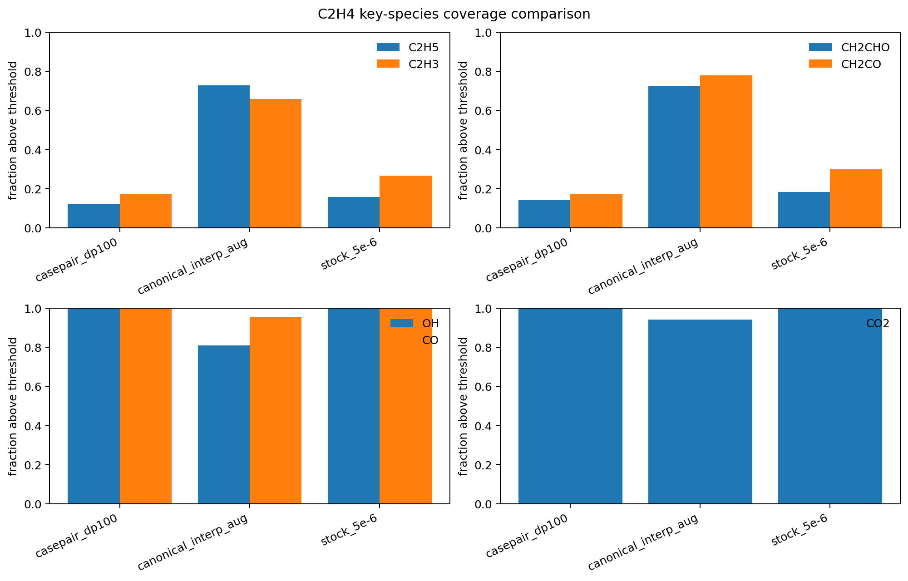

# First C2H4 canonical interpolation+augmentation smoke dataset: local-paper-inspired canonical data can strongly enrich missing intermediates, but the resulting distribution is now likely too reactive unless mixed or filtered more carefully

_Date: 2026-04-24_

## Why this was the next step

After re-reading the other local papers, the strongest next data-generation idea was:
- build data from a canonical 1D flame
- densify underrepresented reactive regions by interpolation
- broaden off-manifold coverage with constrained perturbation
- label with Cantera and filter physically

So the next concrete step was to implement a **small C2H4 prototype** of that workflow and see what kind of thermochemical coverage it actually produces.

## What I built

### New generator
- `/root/workspace/scripts/generate_c2h4_canonical_interpolated_augmented_pairs.py`

This prototype does the following:
1. solve a freely propagating 1D premixed C2H4 flame in Cantera
2. collect canonical thermochemical states
3. interpolate additional states on a temperature grid
4. apply constrained perturbations to `T`, `p`, and species
5. label the perturbed states with one-step Cantera chemistry integration
6. filter using simple physical checks including an HRR-ratio limit

This is intentionally a first smoke prototype, not a final pipeline.

### New coverage-comparison script
- `/root/workspace/scripts/compare_c2h4_dataset_species_coverage.py`

This compares key late-chemistry species coverage across datasets and the stock C2H4 case.

## Smoke dataset generated

Dataset:
- `/root/workspace/data/c2h4_canonical_interp_aug_smoke.npy`
- `/root/workspace/data/c2h4_canonical_interp_aug_smoke.json`

Settings used in this smoke run:
- mechanism: stock `Wu24sp.yaml`
- `phi = 1.0`
- `Tin = 300 K`
- `p = 1 atm`
- `dt = 1e-7`
- interpolation temperature step: `10 K`
- perturb copies per state: `1`
- `alpha_t = 50 K`
- `alpha_p_frac = 0.05`
- `alpha_y = 0.10`
- HRR ratio limit: `50`

Result summary:
- canonical states: `209`
- interpolated states: `416`
- accepted labeled pairs: `414`
- label attempts: `490`
- rejections:
  - `hrr_ratio`: `76`
  - `max_attempts_exhausted`: `2`

So the HRR filter is already active and doing real work even in the small smoke regime.

## Coverage comparison

Artifacts:
- JSON summary:
  - `/root/workspace/artifacts/experiments/deepflame_c2h4_smoke_analysis/c2h4_casepair_vs_canonical_interp_aug_coverage.json`
- figure:
  - `/root/workspace/docs/findings/images/c2h4-casepair-vs-canonical-coverage.png`

## Figure

## Main result

The canonical interpolation+augmentation prototype **very strongly enriches the missing late intermediates** relative to the current case-pair `dp100` dataset.

### Fraction above threshold

#### `C2H5`
- case-pair `dp100`: `0.1226`
- canonical interp+aug: `0.7271`
- stock `5e-06`: `0.1563`

#### `C2H3`
- case-pair `dp100`: `0.1727`
- canonical interp+aug: `0.6570`
- stock `5e-06`: `0.2660`

#### `CH2CHO`
- case-pair `dp100`: `0.1410`
- canonical interp+aug: `0.7222`
- stock `5e-06`: `0.1834`

#### `CH2CO`
- case-pair `dp100`: `0.1709`
- canonical interp+aug: `0.7778`
- stock `5e-06`: `0.2983`

So the paper-inspired canonical path is **absolutely capable of producing the chemistry richness that the current case-pair path is missing**.

## But the first prototype likely overshoots

The same result also carries a warning.

For several of the key intermediates, the canonical interpolation+augmentation smoke dataset is not just richer than the case-pair data — it is much richer even than the active stock case at `5e-6`.

Examples:
- `C2H5` mean
  - case-pair `dp100`: `5.68e-06`
  - canonical interp+aug: `1.15e-04`
  - stock: `1.51e-05`
- `CH2CO` mean
  - case-pair `dp100`: `5.93e-05`
  - canonical interp+aug: `6.23e-04`
  - stock: `2.14e-04`

So this first prototype is probably **too reactive / too enriched** to be used blindly as a replacement dataset.

## Interpretation

This is still a strong positive result because it answers the core question:

### Can a local-paper-inspired canonical data path produce the missing chemistry support?
**Yes. Clearly yes.**

That is important because the recent C2H4 deployment work had narrowed the problem to training-data quality, but had not yet shown that an alternative data path could actually generate the needed intermediate-rich regime.

### Is the first prototype immediately usable as-is?
**Probably not.**

The first canonical interpolation+augmentation smoke dataset appears to over-enrich the late-chemistry region relative to the target stock-case distribution.

So the next challenge is no longer “can we create richer chemistry data?” but rather:
- **how do we calibrate that richness to the solver-relevant distribution?**

## What this changes

This result makes the next path much clearer:
- the canonical/interpolation/perturbation idea is worth continuing
- but it should likely be used in a **mixed or calibrated** way rather than as a blind standalone replacement dataset

Examples of justified next refinements:
- tune interpolation density and perturbation amplitude downward
- tighten physical filtering
- mix canonical augmented states with the current best case-pair `dp100` data
- or condition the canonical path on a narrower temperature/reaction-progress window closer to the target case regime

## Current takeaway

The local-paper-inspired path is now validated at smoke level:
- it can generate the missing intermediate-rich chemistry coverage
- but the first prototype likely overshoots the target CFD distribution
- so the next job is **calibration**, not rediscovery
