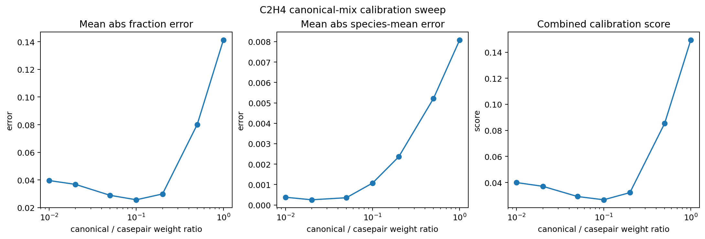

# C2H4 canonical-mix ratio scout: a small canonical fraction looks most promising, with a crude best point near a 0.1 canonical/case-pair weight ratio

_Date: 2026-04-24_

## Why this scout was useful

After the first canonical interpolation+augmentation smoke dataset showed that the paper-inspired path can recover missing intermediates—but likely overshoots the target distribution—the next question was how much of that canonical data could plausibly be mixed into the current `dp100` case-pair dataset before overdriving the chemistry distribution.

This is not yet a trained-model result. It is a **coverage-calibration scout** in data space.

## What I computed

Using:
- case-pair baseline dataset: `/root/workspace/data/c2h4_case_pairs_smoke_dp100.npy`
- canonical augmented smoke dataset: `/root/workspace/data/c2h4_canonical_interp_aug_smoke.npy`
- stock active-state reference from the `5e-6` C2H4 baseline

I swept effective canonical/case-pair mix ratios:
- `0.01`
- `0.02`
- `0.05`
- `0.1`
- `0.2`
- `0.5`
- `1.0`

Script:
- `/root/workspace/scripts/sweep_c2h4_canonical_mix_ratios.py`

Artifacts:
- JSON summary:
  - `/root/workspace/artifacts/experiments/deepflame_c2h4_smoke_analysis/c2h4_canonical_mix_ratio_sweep.json`
- figure:
  - `/root/workspace/docs/findings/images/c2h4-canonical-mix-ratio-sweep.png`

## Figure

## Main result

With the current crude calibration score, the best tested mix point is:
- **canonical / case-pair weight ratio ≈ `0.1`**

That means a **small canonical fraction** looks more promising than either:
- almost no canonical data
- or large canonical fractions that would push the mixture toward the over-reactive canonical smoke distribution

## Why `0.1` is interesting

At ratio `0.1`, several key species get pulled materially closer to the stock active-state distribution without the extreme overshoot of the larger canonical fractions.

Examples:
- `C2H5` mixed mean is almost exactly on top of the stock mean
- `CH2CHO` mixed mean is also close to stock
- `C2H3` and `CH2CO` are still under target, but notably improved versus pure case-pair `dp100`

The broad picture is:
- pure case-pair `dp100` under-represents the intermediate-rich regime
- pure canonical augmentation over-represents it
- a **small canonical fraction** looks like the right direction for calibration

## What this changes

This scout gives a concrete next mixing hypothesis instead of a vague one:
- do **not** try a large canonical replacement
- first try a **small calibrated mix**, around the `0.05–0.1` region

That is now the most justified next training-scale experiment if we want to combine:
- better chemistry richness
- with the solver-relevant distribution of the case-pair data

## Current takeaway

Your scaling-law intuition and the local-paper augmentation ideas fit together well:
- bigger datasets matter
- but the best next scale-up probably uses a **small calibrated canonical fraction**, not a large one

So the current best guess for the next dataset-construction experiment is:
- scale a mixed dataset with something like **`10%` canonical augmented weight relative to the current `dp100` case-pair baseline**.
