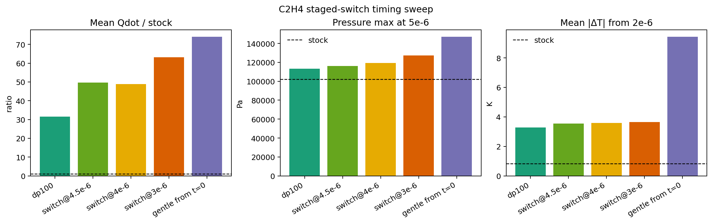

# C2H4 staged-switch timing sweep: later switches are better, and `4.5e-6` is the strongest tested compromise

_Date: 2026-04-24_

## Why this was the next step

After the first staged deployment proof-of-concept (`dp100 -> gentle curriculum` at `4e-6`) looked much healthier than running the late-enriched model from `t=0`, the next obvious question was:

- **how late should the switch happen?**

That is the most useful next deployment-facing step because the current evidence suggests the gentle late-enriched model behaves more like a narrow late specialist than a full-trajectory replacement.

## What I ran

All runs start from a completed pure `dp100` case and switch to the same gentle curriculum model for the remainder of the trajectory.

Gentle curriculum bundle:
- `/root/workspace/artifacts/models/c2h4_casepair_dp100_early_to_late_curriculum_gentle_fno_smoke_deepflame_bundle/`

Tested manual switch times:
- `3e-6`
- `4e-6`
- `4.5e-6`

Cases:
- `/root/workspace/runs/deepflame_c2h4_smoke/c2h4_casepair_dp100_then_gentle_curriculum_from_3e-6`
- `/root/workspace/runs/deepflame_c2h4_smoke/c2h4_casepair_dp100_then_gentle_curriculum_from4e-6`
- `/root/workspace/runs/deepflame_c2h4_smoke/c2h4_casepair_dp100_then_gentle_curriculum_from_4.5e-6`

All three staged-switch cases reached `5e-6` cleanly.

## Comparison artifact

- `/root/workspace/artifacts/experiments/deepflame_c2h4_smoke_analysis/c2h4_gentle_switch_time_sweep_5e-06.json`

## Figure

The figure makes the main deployment tradeoff visible at a glance:
- full-start gentle curriculum is the worst on the broad solver-facing metrics
- all staged switches are materially better than full-start gentle deployment
- later switches stay closer to the pure `dp100` baseline

## Main metrics at `5e-6`

### Pure `dp100` baseline
- mean `Qdot`: `5.12e8`
- pressure max: `113365 Pa`
- mean `|ΔT|`: `3.28 K`

### Full-start gentle curriculum
- mean `Qdot`: `1.20e9`
- pressure max: `146985 Pa`
- mean `|ΔT|`: `9.43 K`

### Switch at `3e-6`
- mean `Qdot`: `1.024e9`
- pressure max: `127161 Pa`
- mean `|ΔT|`: `3.65 K`

### Switch at `4e-6`
- mean `Qdot`: `7.93e8`
- pressure max: `119319 Pa`
- mean `|ΔT|`: `3.60 K`

### Switch at `4.5e-6`
- mean `Qdot`: `8.06e8`
- pressure max: `116082 Pa`
- mean `|ΔT|`: `3.56 K`

## Interpretation

The pattern is clear:
- all staged switches are better than running the gentle curriculum from `t=0`
- **later switches are better than earlier switches**

### Why `4.5e-6` is the strongest tested compromise
Among the tested switch times, `4.5e-6` is the closest overall to the pure `dp100` baseline on the broad solver-facing quality metrics:
- smallest pressure tail among the staged-switch family
- smallest mean `|ΔT|` among the staged-switch family
- mean `Qdot` still above pure `dp100`, but much lower than the `3e-6` switch and far below the full-start gentle curriculum

So the current evidence says the gentle late-enriched model behaves best when treated as a **very narrow late-horizon specialist**.

## Learned activity

All staged-switch runs kept nontrivial learned activity after the switch.

Late active-set counts at `5e-6`:
- switch at `3e-6`: `52928`
- switch at `4e-6`: `46069`
- switch at `4.5e-6`: `43867`

So the later-switch advantage is **not** just a trivial “less learned participation” story. The later switches remain actively used, but they avoid some of the quality damage caused by earlier adoption of the late-enriched model.

## Species-level note

The sweep does **not** change the basic chemistry-fidelity conclusion.

Even the best staged-switch cases still do not recover the missing late intermediates at meaningful mean levels:
- `C2H5`
- `C2H3`
- `CH2CHO`
- `CH2CO`

So the switch-time sweep strengthens the deployment-logic argument, but it does **not** yet solve the underlying late-chemistry-label problem.

## Current takeaway

This sweep strengthens the case for regime-aware deployment:
- **a late-enriched model should not be run from the start**
- if it is used, it should be introduced late
- and among the tested options, `4.5e-6` is the best current manual switch point

## Best tested staged-switch operating point so far

- early trajectory: pure `dp100`
- late switch: gentle curriculum
- switch time: **`4.5e-6`**

This is now the strongest tested proof-of-concept for a regime-aware late-specialist deployment path.

## Most useful next step

The next useful step is to stop hand-editing continuation times and encode this as a more systematic deployment rule:
- either a fixed scheduled switch (e.g. `t >= 4.5e-6`)
- or a simple state-triggered switch rule

That will show whether the staged-switch behavior can be turned into a reusable, operator-facing deployment mode rather than a one-off manual case edit.
